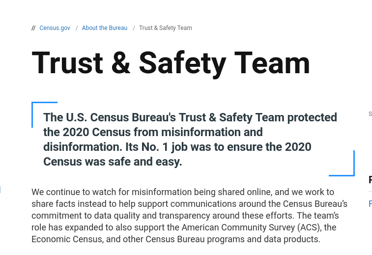
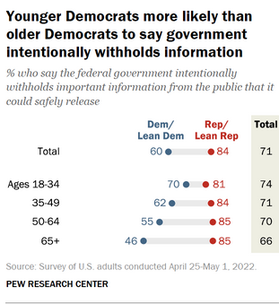
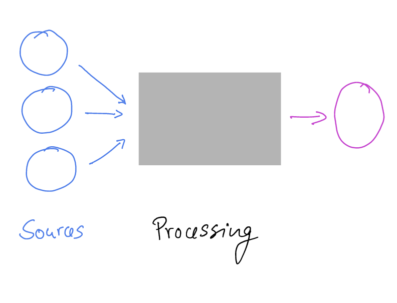

# Trust in Government Statistics

## United Nations

Fundamental Principles of 
Official Statistics, **Principle 3**:

> *Accountability and Transparency*
To facilitate a correct interpretation of the data, 
the statistical agencies are to present information 
according to scientific standards on the sources, 
methods and procedures of the statistics [^UNprinciples]

[^UNprinciples]: [United Nations Fundamental Principles of Official Statistics](https://unstats.un.org/unsd/dnss/gp/FP-New-E.pdf)

## National Academies

Principles and Practices for a Federal Statistical Agency, **Principle 2**: 

> Credibility among Data Users
A federal statistical agency must have credibility
with those who use its data and information [^CNSTAT]

[^CNSTAT]: National Academies of Sciences, Engineering, and Medicine. 2017. Principles and Practices for a Federal Statistical Agency: Sixth Edition. Washington, DC: The National Academies Press. <https://doi.org/10.17226/24810>.

## OMB

"... flow of
objective, **credible** statistics to support
the decisions of individuals,
households, governments, businesses,
and other organizations."

## OMB

Statistical Policy Directive No. 1, 4:

"Any **loss of trust** in the
integrity of the Federal statistical system
and its products could lessen
respondent cooperation with Federal
statistical surveys, decrease the quality
of statistical system products, and foster
uncertainty about the validity of
measures our Nation uses to monitor
and assess its performance and progress."

## Agency efforts

::::{.columns}

:::{.column width="50%"}

[U.S. Census Bureau](https://www.census.gov/about/trust-and-safety.html)

:::

:::{.column width="40%"}

:::

::::

## Agency efforts

::::{.columns}

:::{.column width="50%"}

:::

:::{.column width="40%"}

:::

::::

## Joint Statement {.smaller}

::::{.columns}

:::{.column width="50%"}

[Joint Statement on Commitment to Scientific Integrity and Transparency](https://www.census.gov/content/dam/Census/about/about-the-bureau/policies_and_notices/scientificintegrity/Scientific_Integrity_Statement_of_the_Principal_Statistical_Agencies.pdf)

- **Principle 2**: a Federal statistical agency must have credibility with those who use its data and information;
- **Principle 3**: a Federal statistical agency must have the trust of those whose information it obtains; 

:::

:::{.column width="40%"}

:::

::::

## Waning trust

[Pew Research](https://www.pewresearch.org/politics/2022/06/06/2-public-views-about-the-federal-government/)

::::{.columns}

:::{.column width="50%"}

:::

:::{.column width="50%"}

:::

::::

## Computational Reproducibility and Official Statistics {transition="fade" transition-speed="fast"}

::::{.columns}

:::{.column width="50%"}

Agencies do provide **detailed information on sources**

- Surveys
- Administrative data

:::

:::{.column width="50%"}

:::

::::

## Computational Reproducibility and Official Statistics {transition="fade" transition-speed="fast"}

::::{.columns}

:::{.column width="50%"}

But: **Availability of "computing instructions"**?

- *Code* for cleaning, aggregation, imputation
- Including for *disclosure avoidance*

:::

:::{.column width="50%"}

:::

::::

## Computational Reproducibility and Official Statistics {transition="fade" transition-speed="fast"}

::::{.columns}

:::{.column width="50%"}

But: Availability of **reliable, trusted data archives**

- Of released data –  ability to reproduce downstream uses
- Of source data –  ability to reproduce released data

:::

:::{.column width="50%"}

:::

::::

## The analogy {transition="fade" transition-speed="fast"}

## The analogy {transition="fade" transition-speed="fast"}

## The analogy {transition="fade" transition-speed="fast"}

# Some principles from the academic world

Which are starting to be infused into the federal system

## FAIR Principles

::::{.columns}

:::{.column width="50%"}

FAIR:

- **F**indable
- **A**ccessible
- **I**nteroperable
- **R**eusable

:::

:::{.column width="50%"}

:::

::::

## Data Citation Principles

::::{.columns}

:::{.column width="50%"}

:::

:::{.column width="50%"}

To make it **findable**,

[^dc]

[^dc]:  Data Citation Synthesis Group: Joint Declaration of Data Citation
Principles. Martone M. (ed.) San Diego CA: FORCE11; 2014
<https://www.force11.org/group/joint-declaration-data-citation-principles-final>

:::

::::
