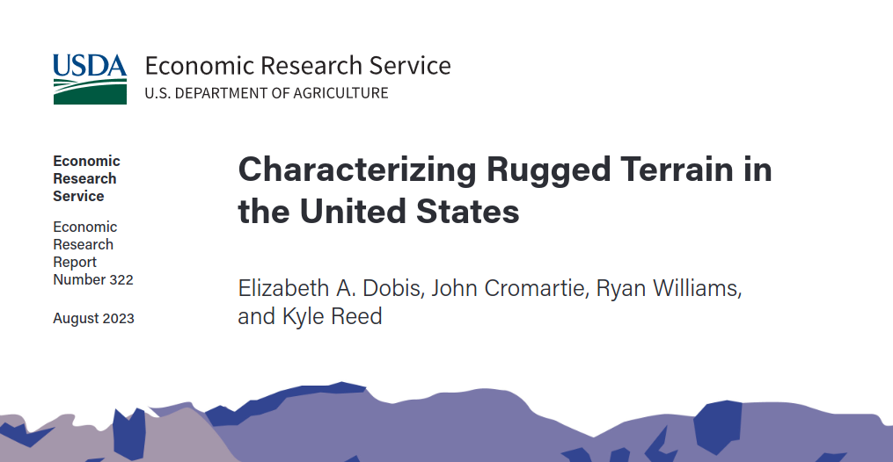
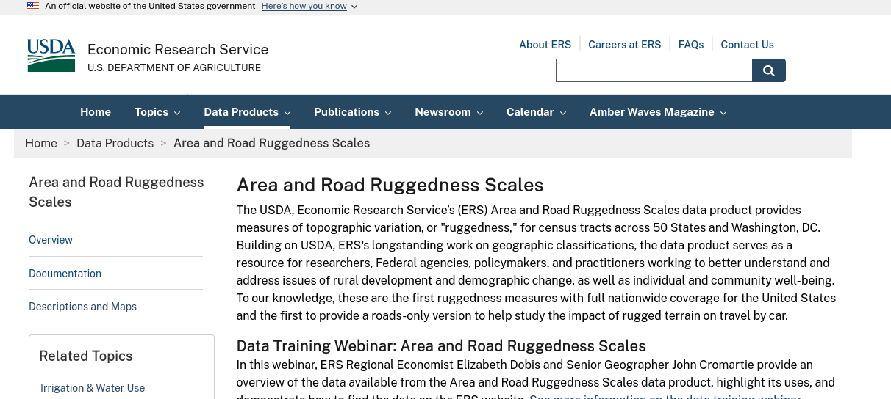
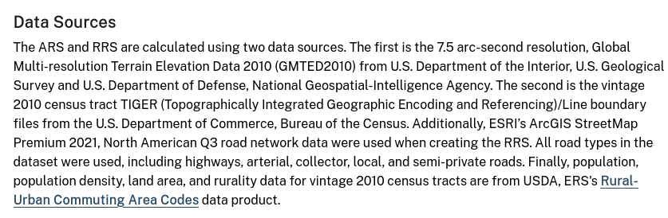
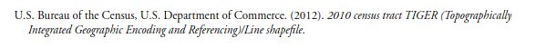
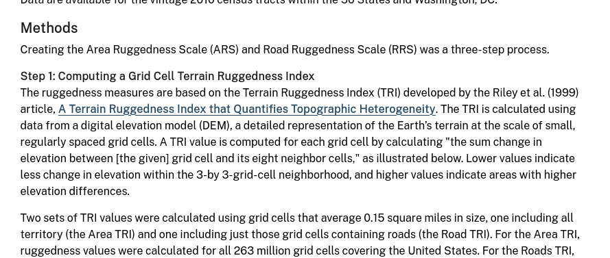
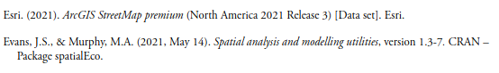
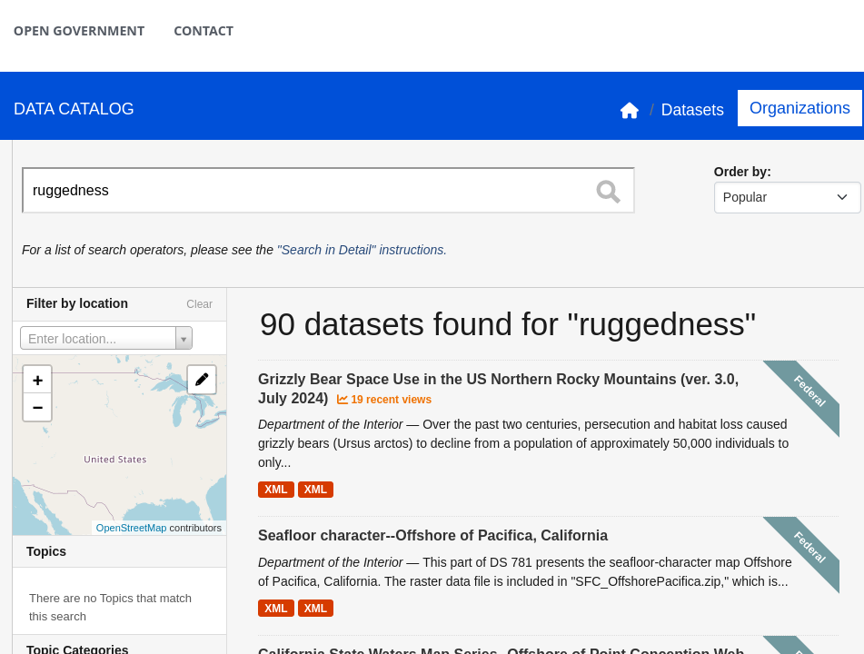
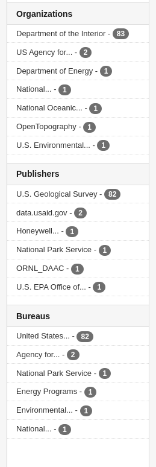
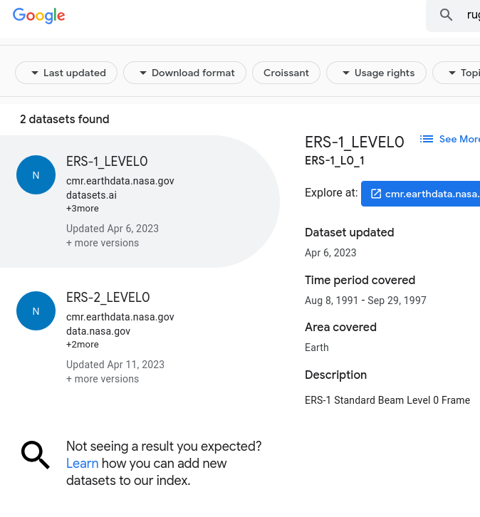

# An example from ERS

 [^ERS-rugged]

[^ERS-rugged]: <https://ers.usda.gov/data-products/area-and-road-ruggedness-scales/>

## Website

## Sources

## Sources

## Methods

## Methods

## Own citation?

## Findability?

::::{.columns}

:::{.column width="50%"}

:::

:::{.column width="50%"}

:::

::::

## Findability?

::::{.columns}

:::{.column width="50%"}

:::

:::{.column width="50%"}

Not even close.

:::

::::

## Repeatability of downloads?

URL is 

**https://ers.usda.gov/webdocs/DataFiles/107356/RuggednessScale2010tracts.xlsx?v=6316.8**

- What will the 2020 tract-based data URL look like?

## Reproducibility?

- Most of the data inputs seem to be public data, or commercially available (ESRI)
- If the code were provided, others should be able to reproduce the analysis

