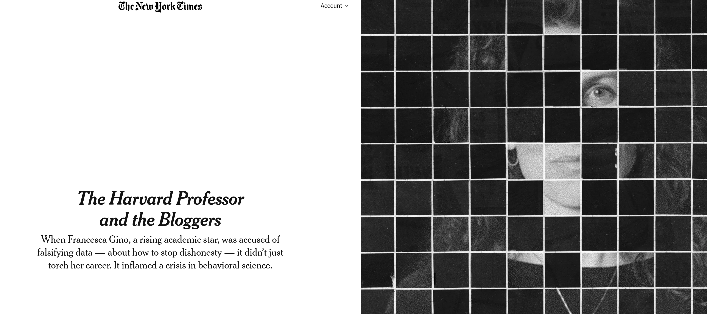
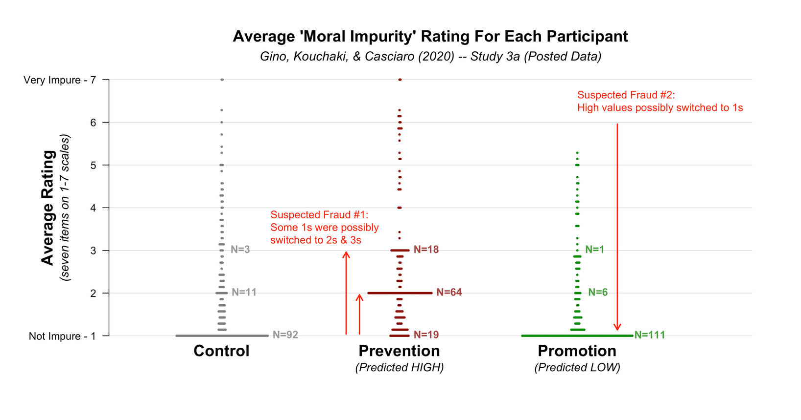
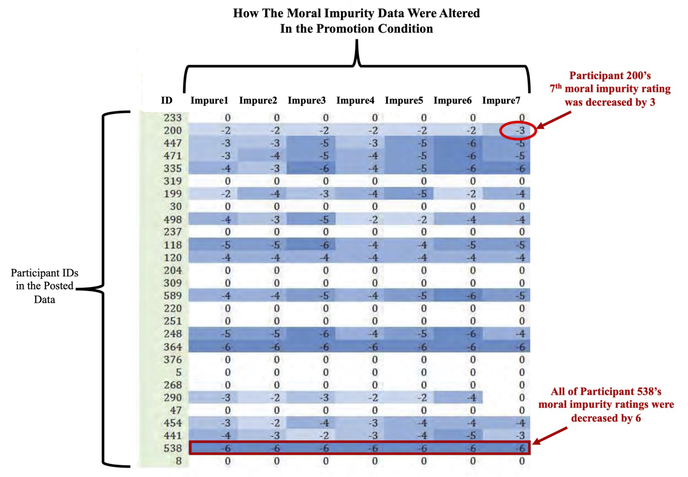
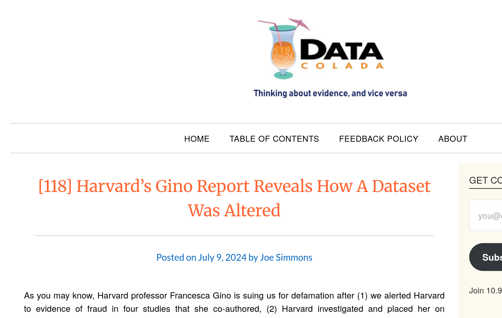

# Opening up technical possibilities

## How can we know that a data source is reliably obtained?

## Consider the case of Gino

## The case of Gino

- Francesca Gino was a tenured professor at Harvard Business School, writing on honesty (!)

## The case of Gino

- Several articles were investigated by third parties (Data Colada, in particular [^colada1]), and found to be problematic

::::{.columns}  

::: {.column width="80%"}

:::
::::

[^colada1]: <https://datacolada.org/109>, <https://datacolada.org/110>, <https://datacolada.org/111>, <https://datacolada.org/112>, <https://datacolada.org/114>, <https://datacolada.org/118>

## The case of Gino

- At least one of them had manipulated data **AFTER** it had been collected, **BEFORE** it had been analyzed.

:::: {.columns}

::: {.column width="50%"}

:::

::: {.column width="50%"}

:::
::::
