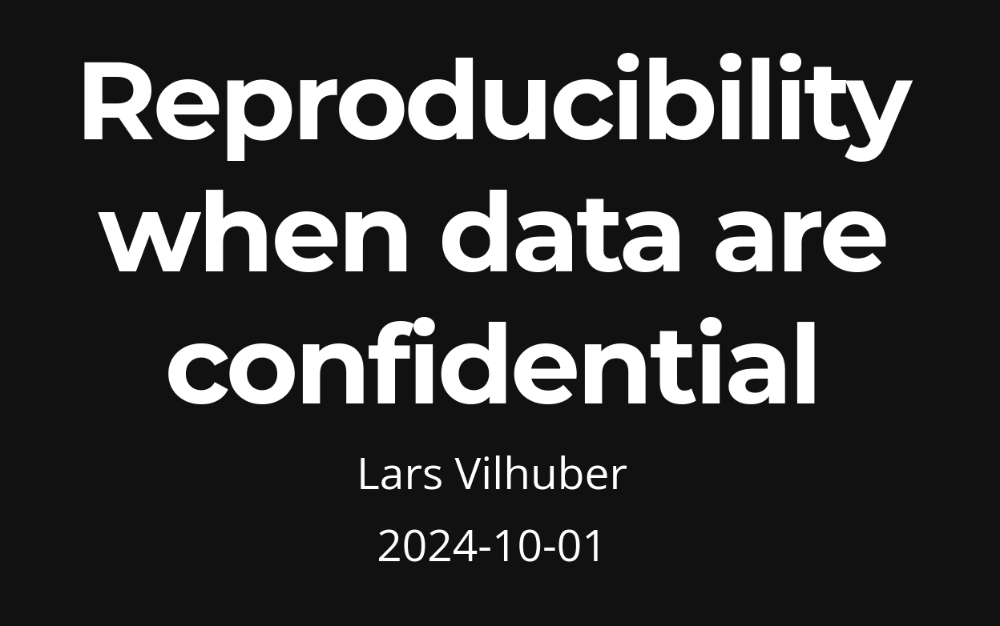

# One more thing...

## That confidential code thing...

- IRS variable names
- File paths b/c your IT department said so
- Use of confidential **data** in code (`if name="Lars" then confid=2`)

## Solution

Don't do that.

## Solution

:::: {.columns}

::: {.column width="70%"}

[labordynamicsinstitute.github.io/reproducibility-confidential/](https://labordynamicsinstitute.github.io/reproducibility-confidential/)

:::

::: {.column width="30%"}

:::

::::

::: aside

Also [here](index.html#/secrets-in-the-code).

:::

